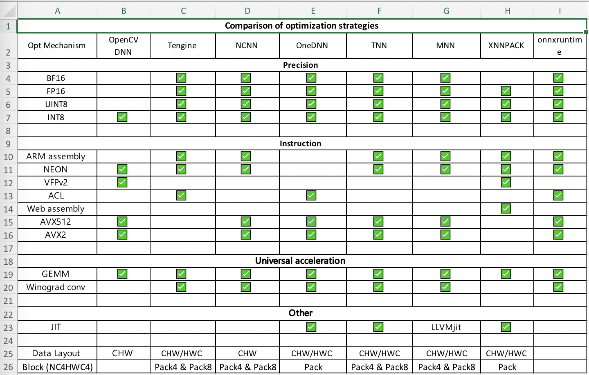

# 2022  OpenCV Technical Committee

* [Markdown Syntax](https://guides.github.com/features/mastering-markdown/)
* OpenCV
   * [OpenCV Home Page](https://opencv.org/)
   * [OpenCV Developer Site](https://github.com/opencv/opencv/wiki)
   * [OpenCV Meeting Notes Home](https://github.com/opencv/opencv/wiki/Meeting_notes)
   * [OpenCV Google Summer of Code (GSoC) ideas page 2022](https://github.com/opencv/opencv/wiki/GSoC_2022)

[[Meeting_notes]]

# Template

<pre>
<><><><><><><><><><><><><><><><><><><><><><><><><><><><><><><>
</pre>

## 2022-mm-dd

## __*Agenda*__
* 

### *__Minutes__*
* 

### *__To Dos__*
* Name
  - [ ] todo

<pre>
<><><><><><><><><><><><><><><><><><><><><><><><><><><><><><><>
</pre>

## 2022-10-12

## __*Agenda*__
* 

### *__Minutes__*

#### OpenCV.ai

**Andrey:**

* Turned on warnings on Windows without exit code on error. [#69](https://github.com/opencv/ci-gha-workflow/pull/69)

* Installed NVIDIA components and fixed following issues on CI Linux x86_64 machine.

* Prepared CI pipelines to build OpenCV with CuDNN support and test DNN module in OpenCV repository. [#22629](https://github.com/opencv/opencv/pull/22629), [#22630](https://github.com/opencv/opencv/pull/22630)

* Prepared CI pipelines to build OpenCV with CUDA, CuDNN, NVIDIA Video Codec SDK, and test cuda modules in OpenCV Contrib repository. [#3363](https://github.com/opencv/opencv_contrib/pull/3363), [#3364](https://github.com/opencv/opencv_contrib/pull/3364)

* Created issues about test failures with CUDA support. [#22623](https://github.com/opencv/opencv/issues/22623), [#3361](https://github.com/opencv/opencv_contrib/issues/3361), [#3361](https://github.com/opencv/opencv_contrib/issues/3362)

**Rostislav:**

* ICP UMats PR: compiles, a lot of issues fixed

* Fisheye undistort bug: PR #22604 provided, PR #22605 with backport also provided, fix does not work, needs investigation

* LMSolver docs issue: PR #22606 provided & merged

**Alexander Panov:**

* Aruco work ...

* checked, added fix comment to Segmentation fault when using aruco.DetectorParameters [#735](https://github.com/opencv/opencv-python/issues/735)

* create PR: add QR alignment markers [#3](https://github.com/opencv/opencv_benchmarks/pull/3) to BoofCV dataset

* Fixed [move aruco](https://github.com/opencv/opencv/pull/22368) issues, awaiting review or merge

**Alexander Smorkalov:**

* Reviewed, tested, helped to resolve issues with #22615, 21966, 22463, 20550, 22577, 22500, 22431, contrib #3360.

* Helped to Andrey with CUDA CI

* Reduce pull requests from 150 to < 100 (JPEG API, community many, missing tests, Python incompatibility issues)

* Windows binaries -- Satya discussions

### *__To Dos__*
* Gary
  - [ ] Talk with Alexander Panov about Aruco python helper

<pre>
<><><><><><><><><><><><><><><><><><><><><><><><><><><><><><><>
</pre>

## 2022-10-05

* Vadim:
  * Finishing block layout (NC4HW4) support in Ficus NN. After it's done and tested, will start porting this engine to OpenCV to make it alternative OpenCV DNN engine in 5.0.
  * OpenCV China. Zihao Mu has finalized StackBlur patch (https://github.com/opencv/opencv/pull/20379) and it has been finally merged. StackBlur is O(1) alternative to GaussianBlur.
* Vincent:
  * Keep porting various code to OpenCV 4.x, there is noticeable progress.
  * Still need to play with fuzzer flags to shut up some false-alarm complains about cvRound(), cvFloor(), cvCeil() not handling NaNs/Infs explicitly.
* Shiqi:
  * This week is holidays in China.
  * 2 students from the Shiqi group are working on:
    * 3D point cloud compression. Currently they use octree.
    * car detection in a point cloud. Currently exploring which models are available and how well they work.
* Alexander S (x.ai):
  * [side note] there is zlib-ng, which we could use for faster png encoding/decoding. Here is the relevant discussion: https://github.com/opencv/opencv/issues/22573
  * Done:
    * Andrey:
      * Prepared WinPack build with OpenCV Contrib modules. [#62](https://github.com/opencv/ci-gha-workflow/pull/62)
      * Tried to run OpenCV tests dynamically in GitHub Actions with two ideas. [#63](https://github.com/opencv/ci-gha-workflow/pull/63), [#64](https://github.com/opencv/ci-gha-workflow/pull/64)
      * Prepared imgaug support for OpenCV Contrib 4.x branch and [#3335](https://github.com/opencv/opencv_contrib/pull/3335). [#65](https://github.com/opencv/ci-gha-workflow/pull/65)
      * Prepared gradle cache for android workflows on Linux x86_64 machine. [#66](https://github.com/opencv/ci-gha-workflow/pull/66)
      * Renamed junit-html artifact by a platform (bug in artifacts). [#67](https://github.com/opencv/ci-gha-workflow/pull/67)
      * Set memory limits for CI pipelines on Ubuntu 14. [#68](https://github.com/opencv/ci-gha-workflow/pull/68)
    * Rostislav:
      * OdometryFrame for ICP rewritten to be read-only and UMat-only, tests written for prepareFrame(), [draft PR](https://github.com/opencv/opencv/pull/22598)
    * Alexander Panov:
      * Merged [#3351](https://github.com/opencv/opencv_contrib/pull/3351), [#22358](https://github.com/opencv/opencv/pull/22358)
      * Fixed [move aruco](https://github.com/opencv/opencv/pull/22368) issues
    * Alexander Smorkalov:
      * Reviewed, tested, helped to resolve issues with #22194, #20379, 22554, 22505, 22573, 22501, 22074, 22194  contrib #3336
    * Egor:
      * Reviewed, tested #22554, 22531, 22500, 22529, 21745
  * In progress:
    * Andrey:
      * Working on enabling hardware accelerated videoio on Linux.
    * Rostislav:
      * PR for UMat-only OdometryFrame is going to be soon
    * Alexander Panov:
      * PR with a new algorithm for detecting the version of the QR code is being prepared.
      * The data with the location of the alignment markers is prepared.

<pre>
<><><><><><><><><><><><><><><><><><><><><><><><><><><><><><><>
</pre>

## 2022-09-21

* Vadim:
  * [GSoC] All the standard-duration GSoC OpenCV projects are finished and they all seem to be successful.
  * new OpenCV DNN. Currently modifying the kernels to use NC4HW4 layout in the case of 8-bit inference. Zihao found that ONNX developers invented quite interesting technology (called DQD) to avoid explosion of the number of operations required to support various quantized models.
  * [OpenCV China] Huawei Ascend backend of OpenCV DNN is in progress. A few more bugs have been fixed. Currently there are some issues with speed and accuracy, Yuantao is working on it.
  * [OpenCV China] Zihao Mu is working on finalizing StackBlur patch: https://github.com/opencv/opencv/pull/20379
  * parallel jpeg decoder/encoder?
* Shiqi:
  * Promoting OpenCV competition: registration for the OAK-based submissions track is over, the other track is end of October: https://opencv.org/opencv-ai-competition-2022
  * Pushing area chair: scheduled meeting with area chairs in the beginning of October.
* Suleyman:
  * Suggested to introduce a separate function to read image header that will retrieve image size and maybe color information etc. Such function can be useful for save image I/O.
* Vincent:
  * OpenCV is officially cited in some copyright notices.
  * Will get back to HLS2RGB.
  * Q: whether OpenCV supports AV1 codec. Alexander S: yes, as long as there is fresh FFMPEG with AV1 codec enabled.
  * Parallel decoding is a good idea, several codecs support it.
  * Possibly it could be useful to have API to decode just part of the image.
  * Sometimes passing environment variables into sandboxed environment can be difficult. Would be nice to have some official API to control image I/O, not via environment variables.
  * Info to retrieve by the image header codec: image size, depth, number of channels, quality (lossy/lossless).
* Gary:
  * TBD
* Alexander S (x.ai):
  * Done:
    * The number of open PRs in the main repository is reduced from ~150 to ~120. The nearest goal is to reduce it further to less than 100.
    * Andrey:
      * Was debugging videoio accuracy test failures on Windows runner and changed an execution of these tests iteratively instead of parallelism. [#13](https://github.com/opencv-infrastructure/opencv-gha-dockerfile/pull/13), [#60](https://github.com/opencv/ci-gha-workflow/pull/60)
      * [Alexander Smorkalov](mailto:alexander.smorkalov@xperience.ai): Reviewed, tested, helped to resolve issues with ## 21942, 20379,  3325, 22363, 22285, 22128, 21966, contrib #3351
    * Alexander Panov:
      * Fixed issues in non-DNN part of WeChat pipeline ([#3351](https://github.com/opencv/opencv_contrib/pull/3351))
      * Implemented early QR code version decoding for classic QR code detector. Statistics on benchmark data: [link](https://docs.google.com/spreadsheets/d/1yiRfVtQwSvQBvpU7tjqzUVl-pm7Tmee1ADPARg3XSFo/edit#gid=485190276).
      * Experiments on lightweight alignment markers detection and accurate alignment for large QRs is in progress.
  * In progress:
    * Andrey:
      * Modifying pipelines in opencv-python repo to triggering them from another repository.
    * Alexander Smorkalov: RISC-V board setup for testing and CI
    * Rostislav: UMat support in ICP and odometry pipeline.

<pre>
<><><><><><><><><><><><><><><><><><><><><><><><><><><><><><><>
</pre>

## 2022-09-14

* Vadim:
  * Implemented Winograd-based 3x3 convolution
  * [GSoC] it's now the final week of the GSoC 2022 (except for the extended projects (we have 1 such project)). Mentors need to submit final evaluations.
  * [OpenCV China] Huawei Ascend backend of OpenCV DNN is in progress. Some weird double-deallocation errors have been fixed. Now it should be able to run the simplest models correctly.
  * [OpenCV China] Zihao Mu is working on finalizing StackBlur patch.
* Shiqi:
  * Tencent developers have replied that they could start working on updating OpenCV's QR code detector early next year.
* Vincent:
  * still working on a weird behaviour in color conversion
  * still working on porting apps to the latest OpenCV 4.x
  * will likely skip a few months in the beginning of next year.
* Gary:
  * now contacting with an organization that can possibly provide some workforce to help with OpenCV development.
* Alexander S (x.ai):
  * Done:
    * OpenCV Python will probably not include the new libspng and libjpeg-turbo + assembly because of possible conflicts with system libs. Will probably revise it later.
    * Multi-camera calibration: in some cases stereo calibration still fails. Need to explore it.
    * QR code detector is being improved. One area where the current detector can be improved is detection of very small QR codes.
    * There is a long track of pending PRs related to Android. Alexander S started to look at it, and also on revision of build scripts for Android.
    * Rostislav:
      * Refactored calibration code to get rid of pointer arithmetics and other C-style constructions, [PR is almost green](https://github.com/opencv/opencv/pull/22499) 
      * Alexander Smorkalov: Reviewed, tested, helped to resolve issues with PRs # 22128, 22227, 22368, 22499, 22329, 22372, 22040, 19955, 21833, 22482, 21945
    * Alexander Panov:
      * Enabled more tests for Wechat qr-code detector.
      * Removed unnecessary upscale in Wechat QR code detector.
      * Fixed remarks on Aruco integration patch and got approval on it from Vadim and Alexander
    * In progress:
      * Rostislav:
        * Fixing calibration PR
        * Fixing UMat issue
      * Alexander Panov:
        * Alignment markers detection for QR code detectors and decoders
      * Alexander Smorkalov:
        * Alexander Smorkalov: Investigated Android media backends testing on Android. Work on tests is in progress.

<pre>
<><><><><><><><><><><><><><><><><><><><><><><><><><><><><><><>
</pre>

## 2022-08-24

* Vadim:
  * TBD
* Vincent:
  * Few PRs/issues have been submitted:
    * for vadim: https://github.com/opencv/opencv/pull/22441
    * alexander: https://github.com/opencv/opencv_contrib/pull/3321
    * you were also asked something in https://github.com/opencv/opencv_contrib/pull/3323.
    * How to move forward on https://github.com/opencv/opencv_contrib/issues/3316 ?
  * Migration to OpenCV 4.x from prev versions is going on. 
* Shiqi:
  * One of the students evaluated face detection algorithms in OpenCV. The current deep learning solution is both much more accurate, more efficient and the model takes less space than the Haar classifier. The detailed report is being prepared.
  * Will contact Tencent team to update QR code detector.
* Alexander S (x.ai):
  * Currently took the role of the main OpenCV maintainer, will see whether Alexander A could get back to active work on OpenCV
  * Found 2 issues in OpenCV QR code detector (both classical and deep-learning based from Tencent):
    * Big QR codes with internal markers are not detected well (well, most of the time they are not detected).
    * QR codes cannot be detected well on images with strong distortion. Classical detection algorithm works better in such case, btw.
    * (note from Shiqi: will contact Tencent team regarding that).
  * Integrated the second PR with RISC-V RVV support by HAN Liutong. 
  * Done:
    * Andrey:
      * Updated zlib to the latest version and removed bzip2 lib for OpenCV Python packages. [#715](https://github.com/opencv/opencv-python/pull/715)
      * Temporarily turned off and then turned on all pipelines on Linux and macOS in case of the network issues. Debugged and fixed it on hosts.
      * Removed “typename” in carotene source code to fix warnings on macOS ARM64. [#22412](https://github.com/opencv/opencv/pull/22412)
      * Changed numpy version to 1.21.4 for macOS builds to fix [#692](https://github.com/opencv/opencv-python/issues/692). [#720](https://github.com/opencv/opencv-python/pull/720)
      * Finished working on WinPack build using VC 16 for 4.x branch. [#43](https://github.com/opencv/ci-gha-workflow/pull/43)
    * Aleksandr P:
      * Merged PR “large image handling in WeChat QrCode detector” [#3287](https://github.com/opencv/opencv_contrib/pull/3287)
      * Prepared and merged PR "QR code, change resize interpolation for Arm" [#22425](https://github.com/opencv/opencv/pull/22425)
      * Prepared and merged PR “remove Objdetect_QRCode_Close.regression/0 test from gtest_filter for 3.4 pipelines” [#56](https://github.com/opencv/ci-gha-workflow/pull/56)
      * Reviewed [#3342](https://github.com/opencv/opencv_contrib/pull/3342)
    * Alexander S:
      * Reviewed, tested, helped to resolve issues with ## 22436, 22164, 22443, 22362, 22425, 22368, 22337, 22236, 22429 contrib #3289, 3287, 3336
  * In progress:
    * Rostislav:
      * Investigating LevMarq stereoCalib [issue #22421](https://github.com/opencv/opencv/issues/22421): found that it caused by  [PR #20225](https://github.com/opencv/opencv/pull/20225) when C API was dropped in favor of      LM written in C++, continue investigating
    * Andrey:
      * Trying to turn on gapi tests for ARM64 CI builds.
      * Filling a spreadsheet with contrib modules.
    * Aleksandr P:
      * PR “move aruco from contrib to objdetect ” [#3325](https://github.com/opencv/opencv_contrib/pull/3325)
      * Fixed Win/IOS build, awaiting review
      * PR “fix output qr corners” [#3289](https://github.com/opencv/opencv_contrib/pull/3289):
rebased, fixed dnn path; added golden corners and points rotate to test; fixed corner order (like in objdetect)

<pre>
<><><><><><><><><><><><><><><><><><><><><><><><><><><><><><><>
</pre>

## 2022-08-17

* Vadim:
  * added initial support for 8-bit quantized models into Ficus NN. Get ~2x acceleration compared to FP16 and ~4x acceleration compared to FP32
  * plan to submit draft PR for OpenCV 5 DNN by the end of August
* Alexander S (x.ai)
  * Done:
    * Aleksandr P: 
      * Fixed and merged PRs [#22382](https://github.com/opencv/opencv/pull/22382), [#996 (https://github.com/opencv/opencv_extra/pull/996) QRcode, change INTER_LINEAR to INTER_LINEAR_EXACT 3.4 
      * Fixed PR [#3287](https://github.com/opencv/opencv_contrib/pull/3287) (large image handling in WeChat QrCode detector), await load WeChat model to default CI
    * Alexander S: Reviews, tested, helped to resolve issues with ## 22372, 22241, 22382, 22376, 22366, 22357,  contrib ## 3287, 3324, python #703 
  * In progress:
    * Aleksandr P:
      * Prepared [PR #3325](https://github.com/opencv/opencv_contrib/pull/3325): move aruco from contrib to objdetect in main repository
      * Debugging and tuning in progress
    * Rostislav:
      * UMat support in odometry pipeline
      * U16 support for NormalComputers, where applicable

<pre>
<><><><><><><><><><><><><><><><><><><><><><><><><><><><><><><>
</pre>

## 2022-08-10

* Vadim:
  * Ficus NN engine is in progress. 'Total' FP16 mode is complete and tested; with few more optimizations Resnet-50 now takes 15ms in FP16 mode, Mobilenet - 3ms. Some more improvements are in progress, then OpenCV-independent vision_detect demo will be finished.
  * Started implementation of the first NN blocks using Loops JIT engine.
  * OpenCV China has prepared the first patch to run Ascend backend of DNN. So far, only convolution layer is supported. Support for many more layers will be added soon.
  * GSoC: RISC-V RVV backend is extended to support many operations, PR is submitted.
* Alexander S (x.ai)
  * Done:
    * Aleksandr P: merged aruco refactoring and class interface [#3240](https://github.com/opencv/opencv_contrib/pull/3240)
    * closed [#3314](https://github.com/opencv/opencv_contrib/issues/3314)
    * prepared PR QRcode, change INTER_LINEAR to INTER_LINEAR_EXACT [#22358](https://github.com/opencv/opencv/pull/22358) (checked performance, fixed tests, fixes susceptibility to the order of found QR codes)
    * Alexander S:
      * Reviewed, tested, helped to resolve issues with #22358, #22241, #22337,  #22339, contrib #3287, python3 #695.
      * Reviewed several solutions for CI: rolling releases for OpenCV-Python packages. MacOS 11 support.
    * Rostislav:
      * Retried ICP with Scale after warpFrame and NormalComputer fixes. It does not work, and finally stopped the investigation.
      * Tuned the tests for NormalComputers: reduced opencv-extra footprint, fixed remarks in the PR.
  * Big question: do we need special Fiducial mode? That will contain Aruco/Chessboard etc. detection algorithms w/o dependency of DNN? A: probably, no.
* Shiqi:
  * Currently on holidays, travelling.
* Gary:
  * Have some draft code to compute location using Aruco/April tags. Sometimes operating 3D geometry in Python is complex and 

<pre>
<><><><><><><><><><><><><><><><><><><><><><><><><><><><><><><>
</pre>

## 2022-08-03

* Vadim:
  * Ficus NN engine is still in progress. 'Total' FP16 mode is more or less complete, enough to run Resnet-50 anyway, but there are still some bugs that are now being resolved.
  * Loops JIT engine has got support for Neon instructions.
  * OpenCV China is proceeding with Ascend backend for OpenCV DNN.
  * Zihao Mu from OpenCV China has contributed several PRs to extend/improve DNN functionality.
* Alexander S (x.ai):
  * Done:
    * Andrey:
      * Prepared Winpack build using VC 16 for 4.x branch. [#43](https://github.com/opencv/ci-gha-workflow/pull/43)
      * Tested Qt5 and Qt6 for [#3285](https://github.com/opencv/opencv_contrib/pull/3285).
      * Debugged an issue in Windows builds after merging obsensor changes in videoio. [#22196](https://github.com/opencv/opencv/pull/22196)
      * Created and updated 4.x and 5.x branches for opencv-python repository. [#696](https://github.com/opencv/opencv-python/pull/696)
      * Fixed nightly docs-js pipelines removing unused lines. [#44](https://github.com/opencv/ci-gha-workflow/pull/44) 
      * Created scheduled rolling workflows for weekly builds and releases of OpenCV Python packages. [#699](https://github.com/opencv/opencv-python/pull/699)
    * Aleksandr P:
      * Reproduced and suggest solution for [#3305](https://github.com/opencv/opencv_contrib/issues/3305), [#3314](https://github.com/opencv/opencv_contrib/issues/3314)
      * ARM64/ARM32 and x86/x64 results are different [#22133](https://github.com/opencv/opencv/issues/22133).
      * There is the problem with resize()+INTER_LINEAR/INTER_CUBIC image. Resizing with a non-integer scale factor works differently on x86/arm.
      * attached images, samples, test another resize flags (INTER_NEAREST/INTER_NEAREST_EXACT - OK) and performance
    * Alexander S:
      * Reviewed, tested, merged PRs ## 22313, 22330, 22223, 22312, 22324, 22057, 22212.
      * Reviewed and helped to resolve issues with python ## 700, 695, 694.
    * Egor:
      * Reviewed, tested:
      * Fix in obsensor for VS 14 [#22339](https://github.com/opencv/opencv/pull/22339)
      * DNN: load fp16 ONNX model as fp32 [#22337](https://github.com/opencv/opencv/pull/22337)
      * DNN: add another two Mish activation to onnx_graph_simplifier [#22311](https://github.com/opencv/opencv/pull/22311)
      * DNN: Reduce Layer (add dynamic batch and ReduceSum support) [#22199](https://github.com/opencv/opencv/pull/22199)
      * DNN: Add qgemm and squeeze op13 supported on ONNXImporter [#22306](https://github.com/opencv/opencv/pull/22306)
  * In progress:
    * Andrey:
      * Changing a runner for OpenCV Python packages builds on macOS x86_64 in case the macOS-10.15 runner is deprecated.
    * Aleksandr P:
      * aruco refactoring and class interface [#3240](https://github.com/opencv/opencv_contrib/pull/3240) - rebased, pushed getter/setter, update tests + refactoring
* Shiqi:
  * OpenCV competition is being prepared; should be announced somewhere next week.
* Gary:
  * GSoC student implemented some framework to compute coordinate transformations between coordinate spaces associated with different joints of a robot.

<pre>
<><><><><><><><><><><><><><><><><><><><><><><><><><><><><><><>
</pre>

## 2022-07-27

It's GSoC 2022 phase-1 time now!
Here is some intermediate status from our respective mentors:

* Yuantao F:
  1. Lightweight object detection model for OpenCV model zoo. The student has provided sample code and quantized model (variation of nanodet): https://github.com/opencv/opencv_zoo/pull/75. Mixed performance, but overall it's a pass. For phase 2 yet another 1-2 models should be added, including variations of yolo and another nanodet.
  2. Multi-task CV model: pull request with code and model in PyTorch format is also there: https://github.com/opencv/opencv_zoo/pull/74. ONNX model is not provided yet. And the model is not quantized yet. At least, it will be converted to FP16 if INT8 does not work properly.
* Zihao M:
  1. Text detection project. PR with DB model is submitted: https://github.com/opencv/opencv_zoo/pull/73. The model works very well, 2Mb (English version) or <10Mb (English+Chinese), it's 2-3x faster than the previous model that was submitted to OpenCV at GSoC 2020.
  2. Text recognition. PR is also submitted: https://github.com/opencv/opencv_zoo/pull/71. Now the quality of the model is being estimated. The model is not quantized yet. Zihao is adding missing operations to OpenCV to support the model.
* Jean-Yves Bouguet:
  1. Maksym is working on multi-camera calibration, including pinhole and fisheye cameras. Some tools in Python have been implemented to visualize calibration process. Now some code is implemented to evaluate how robust is the configuration of cameras, how stable was the calibration process. In other words, we want to detect corner cases, e.g. when the board views occupy very small field of view. Also, the code is going to be tested on real data, not just artificial datasets used so far. Overall, several normal and challenging test cases are going to added. Quite satisfied with the performance.
* Jia W:
  1. Speech recognition model. 2 models are considered. The first model works not well but supported by OpenCV. Another model gives better quality, but is not supported by OpenCV yet (and is also very slow). Pass, but with reservations.
  2. Data augmentation project. The project goes well. 10x-50x faster than TorchVision data augmentation framework. For now only traditional vision transformations are supported. It's a definite pass.
* Prof. Xing:
  1. RISC-V acceleration. The student Liutong works very well, submitted the first PR (and it was merged). It's a pass, of course.
* Suleyman T:
  1. Image codecs project improvements. The student did some progress, 2 PRs have been submitted. Not brilliant progress, but the student should pass to the 2nd stage.

<pre>
<><><><><><><><><><><><><><><><><><><><><><><><><><><><><><><>
</pre>

## 2022-07-13

* Vadim:
  * keep working on inference engine in Ficus. Several image classification models from ONNX model zoo are now supported: Squeeznet, EfficientNetv4-lite, Shufflenet, Googlenet, Inception v1 (v2 proces incorrect results, probably incorrect preprocessing; v3 fails to load because of using ONNX sequences). Now working on FP16 mode
  * GSoC: the 1st RISC-V PR is merged, now the student is preparing update to fix compile errors when all SIMD is turned off
  * OpenCV China: good progress on multi-task model (object detection + pose estimation + semantical segmentation), the quality is 2% lower than claimed in the paper, but the results look reasonably good.
  * OpenCV China: 2 PRs on text detection & recognition have been submitted (they contain benchmarks to evaluate quality).
  * OpenCV China: 1st PR on initial Ascend support (toolchain detection for now) is submitted.
  * FP16 acceleration of convolution is submitted, but fails to compile.
  * AR: invite mentors for the next Wednesday (GSoC phase 1 evaluation: July 25th - July 29th).
* Alexander S (x.ai):
  * Done:
    * Aruco patch is ready and waiting for review (for ~2 weeks already).
    * Significant progress on CI. Even Android on 3.4 branch will likely be tested (using some old NDK release version). Megapack for Windows is not ready not.
    * 2 patches by Rostislav (ICP improvements) are ready for review.
    * Andrey:
      * Split PR docs workflows by a branch and updated docker images, 3.4 and 4.x based on Ubuntu 20.04, 5.x based on Ubuntu 22.04. [#35](https://github.com/opencv/ci-gha-workflow/pull/35), [#8](https://github.com/opencv-infrastructure/opencv-gha-dockerfile/pull/8)
      * Finished fixing compiling warnings in case of hosts issues on Linux x86_64 / ARM64 and macOS x86_64 / ARM64.
      * Fixed defining a path for a local variable to new DNN models on macOS. [#37](https://github.com/opencv/ci-gha-workflow/pull/37)
      * Created an issue about Java Finalize Class.[ #22260](https://github.com/opencv/opencv/issues/22260)
      * Renamed Ubuntu version from 1804 to 2004 for Linux ARM64 builds (just UI change). [#22266]       (https://github.com/opencv/opencv/pull/22266), [#22267](https://github.com/opencv/opencv/pull/22267), [#22268](https://github.com/opencv/opencv/pull/22268)
      * Fixed an issue with the recursion in opencv-python using “ipython”. [#22269](https://github.com/opencv/opencv/pull/22269)
    * Alexander:
      * Migrated Android environment for 3.4 to old NDK 10e. Modern NDK is not filly supported there.
      * Reviewed, tested, helped to resolve issues with ## 22274, 22226, 22269, 22257, #22150, contrib #3240
  * In progress:
    * Andrey:
      * Fixing compiling warnings in case of hosts issues on Windows.
    * Rostislav:
      * Normal computer tests: draft PR #22241 filed; need to check all available data types & rewrite tests on Gtest params; add  parameters to Linemod & expose CV_16U as available depth type
      * 3D module review [draft](https://docs.google.com/document/u/1/d/1cJQzE5c_4N6bltw0wR1KvEAeYa9U2-wqRAyjIXikn8M/edit) written, need to add notes on API consistency & Python wrappers available
* Vincent:
  * porting internal calibration tool to OpenCV 4.x, submitted some PR with fixes
  * it would be nice to have an up-to-date comprehensive list of bit-exact functions somewhere
* Shiqi Yu:
  * no updates so far.

<pre>
<><><><><><><><><><><><><><><><><><><><><><><><><><><><><><><>
</pre>

## 2022-07-13

* Vadim:
  * Keep working on Ficus NN. MobileNet-SSD and TinyYolo v3 are now supported. The further plans include 8-bit & Winograd convolution, FasterRCNN and Mark-RCNN support (ultimately, the goal is to support every single model in ONNX model zoo and OpenCV model zoo), engine refactoring and x86-64 support.
  * There is good progress on Loops JIT engine.
  * OpenCV China: several patches that fix various issues in OpenCV DNN have been prepared are are waiting for review
  * GSoC projects: some go well, some don't. More detailed report will be provided next week.
* Shiqi:
  * Area chairs: prof. Wang invited several his students to participate in OpenCV; they will provide high-quality models for OpenCV. Currently the models are being selected. That may include people detection, pose estimation, gesture recognition.
  * GSoC student working on text recognition now came to Shenzhen, so he would work with Zihao side by side and so the research & development should go faster.
* Alexander S (x.ai):
  * Org: Alexander is on vacation currently
  * Done:
    * Andrey:
      * CI: Defined parallel threads for builds and tests on self-hosted runners. [#32](https://github.com/opencv/ci-gha-workflow/pull/32), [#34](https://github.com/opencv/ci-gha-workflow/pull/34)
      * CI: Prepared compiling warnings handling. [#33](https://github.com/opencv/ci-gha-workflow/pull/33), [#7](https://github.com/opencv-infrastructure/opencv-gha-dockerfile/pull/7)
      * CI: Prepared dockerfiles and pipelines for docs (PR) and docs-js (nightly) builds. [#35](https://github.com/opencv/ci-gha-workflow/pull/35), [#8](https://github.com/opencv-infrastructure/opencv-gha-dockerfile/pull/8)
      * CI: Fixed a problem with "Segmentation fault" error in tests of a coverage build. [#17](https://github.com/opencv/ci-gha-workflow/pull/17)
    * Rostislav:
      * Normals test: draft PR #22241 filed containing normal test based on Blender-rendered data
  * In progress:
    * Andrey:
      * Working on compiling warnings in case of host (all platforms) issues.
    * Rostislav:
      * Finishing normals tests PR
* Vincent:
  * Some internal calibration code is converted from C to C++.
  * Q: Whether Vulkan is preferable API on Android for GPU acceleration. A: will ask.

<pre>
<><><><><><><><><><><><><><><><><><><><><><><><><><><><><><><>
</pre>

## 2022-07-06

* Vadim:
  * Keep working on enabling out-of-the-box MobileNet-SSD ONNX model in Ficus NN engine. 'If' and 'Loop' have been added, now adding remaining operations and debugging the whole graph. It looks like Working on adding subgraph support into Ficus inference engine (in order to support MobileNet-SSD, TinyYolo etc. from Onnx model zoo out of the box)
  * RICV-V GSoC project goes well, the first PR is submitted.
  * Image codecs GSoC 
  * OpenCV China (Yuantao, Zihao): 4 other GSoC projects go well, but we need to make sure that they all produce some results.
  * OpenCV China: Work on adding Ascend support to OpenCV will start this week.
* Alexander S (x.ai):
  * QR benchmark has been merged to opencv_benchmarks.
  * (Alexander Panov): Patch is submitted to OpenCV repo to fix the bug with detecting QR code on high-resolution image (it was super-slow)
  * The issue of different results of QR detector is reproduced, working on a solution.
  * Aruco PR that refactors API is nearly merged to opencv_contrib, all the latest comments have been addressed.
  * Rostislav is working on a new implementation of ICP. Some realistic scenes have been generated in Blender to test it better.
  * OpenCV CI is more or less complete now. iOS and Android pre-commit builders have been added.
  * OpenCV Python is also going to be added to OpenCV CI loop.
  * Calibration project: finally obtained good results for 4-camera calibration setup using calibr. Fisheye model has been used for all cameras; also, some tricks with timestamps have been used.
  * Will be on vacation next week.
* Shiqi Yu (OpenCV China):
  * Had a meeting with one of the area chairs, Syedghouse Nazeerudeen, on Tuesday. Syedghouse Nazeerudeen will work on person detection to contribute algorithms to OpenCV.
  * Prof. Weihong Deng, Area Chair on face recognition and analysis, is working on face attribute recognition. The planned algorithm can provide some face attributes such as gender, age from face images.
* Vincent:
  * Getting rid of OpenCV C API in some internal projects.
  * findChessboardCorners() may have some bugs in the new versions.
* Gary:
  * Extended contract with LearnOpenCV
  * Some negotiations of enabling OpenCV-based solutions in Information Displays
  * Some promising results on Robotic pipelines (including depth-camera based object detection/segmentation), AprilTag/Charuco detection etc. All the code is done in Python with plans to eventually convert some of this code to C++ and integrate to OpenCV. For now it's suggested to create an empty 'placeholder' module, like robo or robots or ... in opencv_contrib.

<pre>
<><><><><><><><><><><><><><><><><><><><><><><><><><><><><><><>
</pre>

## 2022-06-29

* Vadim:
  * Working on adding subgraph support into Ficus inference engine (in order to support MobileNet-SSD, TinyYolo etc. from Onnx model zoo out of the box)
  * RICV-V GSoC project goes well, the first PR is expected next week 
  * OpenCV China (Yuantao, Zihao): debugging issue with the network on ARM64 server
  * OpenCV China (Yuantao): PR with broadcasting support is almost ready; 1-D, 0-D array support is needed to make it fully functional, but for now we will put some workaround
  * OpenCV China (Zihao): patch with convolution is practically finished
  * OpenCV China (Wangli): script for measuring quality of object detection models is in progress.  
* Alexander S (x.ai):
  * Done:
    * Andrey:
      * Debugged an issue with the “data” folder in OpenCV build with CUDA, stuck on NVCC building. [#21958](https://github.com/opencv/opencv/issues/21958)
      * Tried to reproduce an issue to build OpenCV Python package from source on Ubuntu 22.04, the issue did not happen, anything was built without any issues. [#571](https://github.com/opencv/opencv-python/issues/571#issuecomment-1159676647)
      * Changed hosts for OpenCV Python packages building from Xperience (Mac Mini, Jetson nano) side to OpenCV CN (Linux ARM64 server, Mac Mini ARM64). [#681](https://github.com/opencv/opencv-python/pull/681)
      * Found out that we had been building OpenCV in GitHub Actions on macOS without ffmpeg, and fixed it.
      * Fixed issues with git configs inside a container. [#23](https://github.com/opencv/ci-gha-workflow/pull/23), [#24](https://github.com/opencv/ci-gha-workflow/pull/24), [#4](https://github.com/opencv-infrastructure/opencv-gha-dockerfile/pull/4)
      * Fixed the CLCache issue with permission denied during OpenCV build on Windows.
    * Aleksandr P:
      * aruco refactoring and class interface [#3240](https://github.com/opencv/opencv_contrib/pull/3240): squash commits (previously save commit history to another branch), rebased, fixed issues.
      * Updated [QR code benchmark - PR](https://github.com/opencv/opencv_benchmarks/pull/2) - added writing statistics in yaml, added metrics (L_1, L_inf), fixed Readme
  * In progress:
    * Andrey:
      * Debugging an issue when videoio tests fail with ffmpeg on macOS ARM64.
      * Implementing nightly dnn models update.
    * Aleksandr P:
      * PR fix large image [#3287](https://github.com/opencv/opencv_contrib/pull/3287) for wechat QR: refactoring, added DetectorParametersDL, created test. Need to add reading wechat model to correctly testing (there is no one test with wechat's model testing). 
      * issue detectMulti() works differently in x86-64 and in ARM64 [#22133](https://github.com/opencv/opencv/issues/22133):
Reproduced with raspberry pi 4, debugging is in process
    * Rostislav is working on stabilizing ICP algorithm, a few problems have been discovered. In particular, normals, computed from the point cloud, are very different when the point cloud is scaled.
    * Rostislav is composing a list of 3D point cloud processing algorithms that would be useful to have in OpenCV 5.
  * Issues: Victor has left the team, some activities on the new camera calibration are put on hold.
* Vincent:
  * finished big project on porting some internal stuff to fresh OpenCV (4.6.x).
  * custom InputArray/OutputArray would definitely be useful (https://github.com/opencv/opencv/issues/20869)

<pre>
<><><><><><><><><><><><><><><><><><><><><><><><><><><><><><><>
</pre>

## 2022-06-22

* Vadim:
  * Ficus NN. Yolo v4 nows works well, takes ~220ms in FP32 precision, 150ms in FP16 precision (Apple M1). Started working on adding MobileNet-SSD support, which would require handling control flow Onnx operations: Loop and If.
  * Ficus NN. Constant folding optimization is implemented.
  * OpenCV China: polishing convolution acceleration patch and broadcast support patch. Almost ready.
* Alexander S (x.ai)
  * Done:
    * Andrey:
      * Fixed issues on Mac Mini (OpenCV CN) to use it instead of Xperience Mac Mini for iOS builds. [#19](https://docs.google.com/document/d/191IFudBtiXbxR7j-Jn5ifVmZgxUdHVC-0k78nzP7D6E/edit?folder=1esTqgXG2FKtlBqJz9G_4epkZJ3L9FPUH#19)
      * Created PRs with workflows to iOS build in OpenCV repository. [#22110](https://github.com/opencv/opencv/pull/22110), [#22111](https://github.com/opencv/opencv/pull/22111), [#22112](https://github.com/opencv/opencv/pull/22112)
      * Updated spreadsheet with OpenCV custom builds in OpenCV Shared Google Drive ([link](https://docs.google.com/spreadsheets/d/1s8imGh8qPy-zAbORbDjFpleRU5ltIMnsAl5_NF5l5ug/edit#gid=0)).
      * Removed pylint in all workflows, but not in U20. [#20](https://github.com/opencv/ci-gha-workflow/pull/20)
      * Moved git config from GitHub Actions to docker side. [#21](https://github.com/opencv/ci-gha-workflow/pull/21), [#3](https://github.com/opencv-infrastructure/opencv-gha-dockerfile/pull/3)
    * Rostislav:
      * ICP and scale: implemented one more normal computer (cross-product based) which doesn’t depend on depth scale; found several more issues with ICP-related functionality, see “In progress” section
    * Egor:
      * Reviewed:
        * Fix issue 22015, let Clip layer support 1-3 inputs [#22100](https://github.com/opencv/opencv/pull/22100). bug fixed of GEMM node in ONNX_importer [#22122](https://github.com/opencv/opencv/pull/22122)
      * Created PRs:
        * Add option to force reopen camera in interactive calibration tool [#22135](https://github.com/opencv/opencv/pull/22135)
        * Add symmetric circles board [#22146](https://github.com/opencv/opencv/pull/22146).
        * Draft PR: Add zoom factor to interactive calibration tool [#22147](https://github.com/opencv/opencv/pull/22147)
    * Aleksandr P:
      * open PR fix large image #3287  for wechat QR
      * open PR fix output qr corners #3289  for wechat QR
      * open issue detectMulti() x86-64 and detectMulti() ARM64 work differently in QRCodeDetector in some cases #22133
    * Alexander S:
      * Reviewed, tested, helped to resolve issues: opencv_benchmarks ## 1, 2, opencv #22065, 22146
  * In progress:
    * Andrey:
      * Debugging an issue with the “data” folder in OpenCV build with CUDA. [#21958](https://github.com/opencv/opencv/issues/21958)
      * Reproducing an issue to build OpenCV Python package from source on Ubuntu 22.04. [#571](https://github.com/opencv/opencv-python/issues/571#issuecomment-1159676647)
    * Rostislav:
      * ICP: getting rid of scale workaround, found that FastICP does not work on large depth scale; warpFrame() has 2 versions (in 3d module src and tests), diverges on different depth scales and not covered by tests; normal computers have not enough tests and possibly depend on depth scale; normals pyramid is possibly calculated in wrong way

<pre>
<><><><><><><><><><><><><><><><><><><><><><><><><><><><><><><>
</pre>

## 2022-06-15

* Vadim:
  * Watching over several GSoC 2022 projects, e.g. RISC-V & light-weight object detection. They are on track; good progress on RISC-V
  * Keep working on NN engine in Ficus; Yolo v4 support is almost finished; now debugging the code. Several optimizations, e.g. graph optimizations, can then be propagated to OpenCV. 
* Shiqi:
  * WeChat agreed to update QR detector and decoder in opencv/contrib to the current one in WeChat app. It will be finished in ~2 months.
* Gary:
  * Keep working on GSoC 2022 projects. April Tags detection + 3D pose/depth estimation part is functioning.
* Alexander S (x.ai):
  * Done:
    * Andrey:
      * Fixed OpenCV Python source package build and upload. [#672](https://github.com/opencv/opencv-python/pull/672), [#673](https://github.com/opencv/opencv-python/pull/673)
      * Added a timeout for each step in GitHub Actions. [#14](https://github.com/opencv/ci-gha-workflow/pull/14)
      * Fixed an issue in calib test on macOS x86_64. [#15](https://github.com/opencv/ci-gha-workflow/pull/15) (known OpenCV issue [#20202](https://github.com/opencv/opencv/issues/20202))
      * Disabled OpenCL support in macOS ARM64 workflows and changed a list of filtered tests. [#16](https://github.com/opencv/ci-gha-workflow/pull/16)
      * Prepared nightly coverage workflow. [#17](https://github.com/opencv/ci-gha-workflow/pull/17)
    * Aleksandr P: reviewed issue return four vertices of qr code instead of axis aligned bounding box [#3238 (https://github.com/opencv/opencv_contrib/pull/3238)
    * Alexander S: 
      * reviewed and tested qrcode benchmark and synthetic calibration benchmark with Blender.
      * Implemented option to save useful frames in interactive calibration tool ([#22079 (https://github.com/opencv/opencv/pull/22079))
    * Rostislav:
      * Tried to complete [ICP with scale](https://github.com/opencv/opencv/pull/21581#) #21581 pr. The approach does not work with scale more than 3%. Decided to clone. Proposed PR with bug fixes and refactoring that was applied for the PR.
  * In progress:
    * Andrey:
      * Fixing issues on Mac Mini (OpenCV CN) to use it instead of Xperience Mac Mini.
    * Victor:
      * Synthetic (blender) camera calibration benchmark
    * Alexandr P: opened draft PR [python QR code benchmar](https://github.com/opencv/opencv_benchmarks/pull/2)k
      * added processing for multiply qr codes
      * added print to yaml format, added ArgumentParser, added WeChat
      * run on Jetson (ARM), detected different behavior with x86/x64
      * Alexandr P: open issue “detectMulti() and detect() work differently in QRCodeDetector [#22107 (https://github.com/opencv/opencv/issues/22107)” with sample and reproducer. Fix in process.

<pre>
<><><><><><><><><><><><><><><><><><><><><><><><><><><><><><><>
</pre>

## 2022-06-08

* Vadim:
  * Keep working on accelerating OpenCV DNN and implementing inference engine in Ficus
  * Participated (as expert) is several GSoC meetings; the students have actually started to work on their projects.
* Shiqi:
  * Initial area chairs meeting has been organized. Now it's planned to have 1:1 meetings to clarify the scope and define the nearest plans.
* Gary:
  * not much to update.
  * GSoC student has started working on the project.
* Alexander S (x.ai):
  * QR code comparison: https://www.dynamsoft.com/codepool/qr-code-reading-benchmark-and-comparison.html
  * Done:
    * Andrey:
      * Built artifacts for OpenCV 4.6.0 release (iOS Framework, Android SDK).
      * Created and published OpenCV Python releases ([3.4.18.65](https://github.com/opencv/opencv-python/releases/tag/65), [4.6.0.66](https://github.com/opencv/opencv-python/releases/tag/66)).
      * Added extended DNN testing in GitHub Actions on Windows. [#13](https://github.com/opencv/ci-gha-workflow/pull/13)
      * Prepared Git cache nightly update on all CI machines. [#8](https://github.com/opencv/ci-gha-workflow/pull/8)
      * Registered more macOS self-hosted runners for x86_64 and ARM64 (OpenCV CN machines).
      * Added an enhancement for current tests run in OpenCV and OpenCV Contrib CI to run tests even if a previous unit test failed. [#9](https://github.com/opencv/ci-gha-workflow/pull/9)
    * Alexander P: fixing QR code PR “Fix sampling for version multiplying factor [#22025](https://github.com/opencv/opencv/pull/22025)”
      * Fixed and merged, PR fixed issues [#21287](https://github.com/opencv/opencv/issues/21287) and [#21929](https://github.com/opencv/opencv/issues/21929)
    * Alexander P: PR: aruco “fix axes and docs [#3256](https://github.com/opencv/opencv_contrib/pull/3256)”
      * Fixed and merged, PR fixed issues  [#3250](https://github.com/opencv/opencv_contrib/issues/3250) and [#3252](https://github.com/opencv/opencv_contrib/issues/3252)
    * Rostislav: surface matching PR #2995@contrib reviewed, approved & merged
    * Alexander S: Reviewed, tested, help to resolve issues with ## 22018, 21407.
    * Alexander S: Proposed option for interactive calibration tool to save images that contribute to calibration result #22079.
    * Alexander S: tested OpenCV4Android SDK manually. Helped with release.
  * In progress:
    * Andrey:
      * Adding coverage in GitHub Actions.
      * Adding a timeout for each step in GitHub Actions.
    * Victor:
      * Synthetic (blender) camera calibration benchmark
    * Rostislav:
      * ICP + scale: limited by 3% improvement, revising math to get better result
    * Alexander P: add base version (only check detect without decode) for QR code benchmark (now doesn’t always work for samples with several qr codes).
    * Alexander P:  PR aruco refactoring and class interface [#3240](https://github.com/opencv/opencv_contrib/pull/3240) : rebased and fixed

## 2022-06-01

* Vadim:
  * accelerated DNN using hybrid FP32+FP16 pipeline (FP16 is done using ARM v8.2 NEON instructions). Resnet-50 now takes 17.6ms, Mobilenet 3.3ms. The patch with FP16 compute path in convolution will be added after the new FP32 acceleration is integrated.
  * Vadim, Yuantao, Zihao and Jia from OpenCV China have conducted initial meetings with GSoC 2022 participants, 5 meetings in total. The other ones will be held within this and early next week.
  * License plate detection model has been added to OpenCV Model Zoo. It's an open question how to test the quality and performance of quantized models that we put to the model zoo.
  * macOS testing is being restored using h/w (M1 mac mini) in OpenCV China CI in SuSTech univ., Shenzhen.
* Alexander S (x.ai):
  * Done:
    * Andrey:
      * Registered Mac Mini with Intel chip and Mac Mini with M1 chip (OpenCV China machines) as self-hosted runners for OpenCV organization.
      * Debugged an issue with linking libpng in OpenCV Python packages, and fixed it updating libpng to 1.6.37. [#662](https://github.com/opencv/opencv-python/issues/662), [#666](https://github.com/opencv/opencv-python/pull/666)
      * Updated dependencies for the next release. [#666](https://github.com/opencv/opencv-python/pull/666). It should fix several opened issues [#659](https://github.com/opencv/opencv-python/issues/659), [#658](https://github.com/opencv/opencv-python/issues/658).
      * Fixed Xcode version matching for OpenCV iOS framework building. [#22054](https://github.com/opencv/opencv/pull/22054)
      * Prepared GitHub Actions for OpenCV iOS framework building. [#6](https://github.com/opencv/ci-gha-workflow/pull/6)
      * Tested updated 3.4 and master (4.x) branches in opencv-python repository with latest OpenCV and OpenCV Contrib for the next release. [#668](https://github.com/opencv/opencv-python/pull/668), [#670](https://github.com/opencv/opencv-python/pull/670)
    * Egor:
      * Reviewed [#7781](https://github.com/google/oss-fuzz/pull/7781)(to oss-fuzz), [#22041](https://github.com/opencv/opencv/pull/22041), [#22050](https://github.com/opencv/opencv/pull/22050).
      * Alexander P: fixed issues (fixed docs, tutorials, added image) for PR: aruco “fix axes and docs [#3256](https://github.com/opencv/opencv_contrib/pull/3256)”
    * Victor:
      * Figured out with opencv fisheye model and update docs
      * Obtain fist benchmark result for 2 camera model, 4.x, 5.x opencv version, 3 datasets
      * Alexander S: Reviewed tested, helped to resolve issues with contrib ## 3256, 3247, python # 666, opencv ## 22045, 21949, 21841
  * In progress:
    * Andrey:
      * Adding extended DNN testing in GitHub Actions on Windows.
      * Preparing nightly pipelines to update Git cache on CI machines
      * Alexander P: fixing QR code PR “Fix sampling for version multiplying factor [#22025](https://github.com/opencv/opencv/pull/22025)”
      * Also other QR problems are being fixed: rounding problems (fixed, will be implemented to[#22025](https://github.com/opencv/opencv/pull/22025)), redundant steps (fixed, will be implemented to [#22025](https://github.com/opencv/opencv/pull/22025)), inaccurate 4-th marker corner (fixed, will be implemented in new PR), scaling problems (now fix breaks 4 tests, will be implemented in new PR).
    * Victor:
      * cornerSubPix() benchmark
      * Calibration tutorial is in progress
      * Blender calibration synthetic dataset: generation is in progress
    * Alexander S: OpenCV for Android build pipeline and dockerfile for branch 3.4
* Shiqi:
  * LoongSon has donated OpenCV China a server to test OpenCV on this hardware (in our CI). The server is based on their custom CPU.
    * They also provided patch to add LoongSon-specific optimization to OpenCV: https://github.com/opencv/opencv/pull/21833
* Vincent:
  * working on improving imgcodecs robustness.

<pre>
<><><><><><><><><><><><><><><><><><><><><><><><><><><><><><><>
</pre>

## 2022-05-25

* Vadim:
  * All OpenCV GSoC projects we voted for have been accepted! Congratulations to all the accepted students!
  * Vadim together with OpenCV China folks continue to optimize OpenCV DNN Engine (convolution kernel mostly) and the standalone DL inference engine in Ficus; Resnet-50, batch_size=1, FP32 precision, is now processed in 26.6ms on Apple M1 (4 threads)! It's quite a breakthrough compared to 37-42ms in the previous version of the patch (and much better than 60+ ms in the existing OpenCV). Now the patch needs to be updated with the latest changes that brought the extra performance.
* Alexander S (x.ai):
  * Done:
    * Andrey: 
      * Moved GitHub Actions workflows to a dedicated repository. [#22001](https://github.com/opencv/opencv/pull/22001), [#22013]      (https://github.com/opencv/opencv/pull/22013), [#22014](https://github.com/opencv/opencv/pull/22014), [#3257](https://github.com/opencv/opencv_contrib/pull/3257), [#3258](https://github.com/opencv/opencv_contrib/pull/3258), [#3259](https://github.com/opencv/opencv_contrib/pull/3259),[ #2](https://github.com/opencv/ci-gha-workflow/pull/2)
      * Fixed bugs in current workflows in a dedicated repo. [#3](https://github.com/opencv/ci-gha-workflow/pull/3)
      * Re-registered all self-hosted runners, but this time did this for the OpenCV organization.
    * Victor: All problems in test_cameracalibratiin.cpp are fixed
    * Victor: Provided correct sample and created PR request for documentation update for cv::fisheye::distortPoints()
    * Alexander S: Reviewed, tested, helped to resolve issues with contrib ## 3240, 3264, 3256, 3248, 3248, opencv ## 22027, 21841,  22026, 22019. Reviewed remaining open PRs. Closed several abandoned and not relevant any more
    * Alexander S: Finished docker environment for OpenCV for Android SDK and implemented Github Actions Pipeline for it.
    * Alexander P: Prepared PRs: aruco “fix axes and docs #3256”, QR codes “Fix sampling for version multiplying factor #22025”
  * In progress:
    * Andrey:
      * Changing libpng version for OpenCV python packages. [#662](https://github.com/opencv/opencv-python/issues/662)
      * Updating dependencies for OpenCV python packages release.
      * Adding extended DNN testing in GitHub Actions on Windows.
    * Victor: Camera models calibration benchmark
    * Victor: Read and understand a lot of issues about unstable camera calibration, read connected papers
    * Alexander P: reviewed PR “objdetect: Fix sampling QR code image #21949”
    * Alexander P: fixed “Failed to allocate ... bytes (tens of GBs) #21287”, try to fix the decode of QR. Found problems in the QR code
detection pipeline.
* Vincent:
  * Found problem with imencode/imdecode where huge images that take >2Gb (MAX_INT elements) cannot be properly encoded/decoded.
* Shiqi Yu:
  * The student has his first PR to OpenCV merged: https://github.com/opencv/opencv/pull/21918.
* Gary:
  * Started talking to the student on OAK-D GSoC project.
* Stefano:
  * Pls, take a look at those 2 projects:
    * https://github.com/llvm/torch-mlir
    * https://github.com/onnx/onnx-mlir

<pre>
<><><><><><><><><><><><><><><><><><><><><><><><><><><><><><><>
</pre>

## 2022-05-18

* Vadim:
  * Google is processing our selection.
  * Keep working on inference engine in Ficus
  * OpenCV China: still working on Winograd, managed to get a slight acceleration over im2row+gemm based approach; has prepared patch to handle asymmetric padding in quantized convolution.
* Gary:
  * 
* Alexander S (x.ai):
  * There are some interesting attempts to use OpenCV on microcontrollers:
    * OpenCV for ESP32: https://github.com/joachimBurket/esp32-opencv
    * OpenCV for STM32 series (ARM). Forum: https://forum.opencv.org/t/opencv-on-stm32/4149. Usage examples: 
https://medium.com/@deryugin.denis/how-to-run-opencv-on-stm32-mcu-b581f42b0766
  * It would be nice to have some dedicated CMake options to reduce OpenCV size.
  * OpenCV 4.6.0 is going to be released in the end of May - beginning of June. x.ai folks took over the maintenance for now while Intel team is on vacation. The goal is to use github actions to generate all necessary packages (maybe except for the ios framework, which we'll skip this time).
  * Done:
    * Andrey: 
      * Updated all current GitHub Actions to use self-hosted runners with Git cache, Ccache. [#21994 (https://github.com/opencv/opencv/pull/21994)
      * Prepared workflows for OpenCV Contrib repository. [#1](https://github.com/opencv-infrastructure/opencv-gha-workflow/pull/1)
      * Added extended DNN testing in GitHub Actions on Linux. [#21994](https://github.com/opencv/opencv/pull/21994)
      * Moved dockerfiles for OpenCV CI images to a [dedicated repository](https://github.com/opencv-infrastructure/opencv-gha-dockerfile).
    * Victor:
      * Discussed and approved .clang-format 
      * Found wrong documentation in opencv-python
      * Dig into pinhole calibration test with #21810. Found issues:  wrong calibration relative error threshold (1.1), strange and suspicious rVec transpose, incorrect rotation matrix check, unargued thresholds.
    * Alexander S: 
      * Reviewed, tested, helped to resolve issues with python #662,  ##21941, 21934, 21974, 21963, 21954, 21992
      * Reviewed a bunch of PRs with new Github Actions pipelines.
  * In progress:
    * Andrey: 
      * Moving GitHub Actions workflows to a dedicated repository.
      * Adding extended DNN testing in GitHub Actions on Windows.
    * Victor:
      * Camera models calibration benchmark
    * Alexandr P:
      * PR “aruco class interface and pimpl [#3233](https://github.com/opencv/opencv_contrib/pull/3233)”
rebased with new contrib, added new Java binding tests and ability to load/save ArucoDetector (inherited from cv::Algorithm)
      * issue aruco: marker origin no longer at center #3252 - prepared fix
      * issues QR code #21949, #21287, #21417 - reproduced, fix is being prepared
    * Alexander S:
      * Docker image and CI pipeline for Android SDK.
* Vincent:
  * 
* Shiqi:
  * No updates yet from Google regarding accepted projects.

<pre>
<><><><><><><><><><><><><><><><><><><><><><><><><><><><><><><>
</pre>

## 2022-05-11

* Vadim:
  * Need to sort GSoC proposals, choose the best ones by May 12th.
  * Keep working on inference engine in Ficus
  * OpenCV China: prepared the first version of Winograd-based convolution - not as fast as the latest im2row + gemm.
* Gary:
  * 
* Alexander S (x.ai):
  * Done:
    * Alexander S: 
      * Reviewed new CI pipelines with Github Actions
      * reviewed, tested, helped to resolve issues with ## 21954, 21966, 21937, 21963, 21939, 21943, 21952, contrib #3240.
      * Prepared agenda and proposal document on new camera calibration toolkit.
      * Andrey: Registered all OpenCV CN servers as self-hosted runners for OpenCV Github Actions.
    * Victor:
      * Proposed undistortImagePoints() PR #21931
      * Reviewed  opencv_contrib #3243.
  * In progress:
    * Alexandr P:
      * PR “aruco class interface and pimpl #3233”
      * prepared PR for review (refactoring code and docs, fixing issues)
      * java binding test are being prepared
      * cv::Algorithm implementation for ArucoDetector is being prepared
    * Andrey: Preparing workflows for OpenCV Contrib repository.
    * Victor
      * New TermCriteria interface
      * Camera calibration toolkit proposal
* Vincent:
  * Migrating OpenCV 3.x to 4.x. Hopefully, soon there will be just one OpenCV version at G.
* Shiqi:
  * Can add 1 more student to OpenCV China team. He is working on OpenCV PRs for quite some time already.

<pre>
<><><><><><><><><><><><><><><><><><><><><><><><><><><><><><><>
</pre>

## 2022-05-04

* Vadim:
  * Reviewing GSoC 2022 proposals. Hopefully, we will have ~5-10 projects (at least the number of good proposals is within this range).
  * Experimental inference in Ficus is still in progress. Performance is significantly better than the current OpenCV, but lower than with MNN, ncnn and Mindspore Lite; trying to address the performance gap
* Gary:
  * will try to get ~2 students beyond GSoC to work on OpenCV during summer.
  * fund-raising activities
* Alexander S (x.ai):
  * Done:
    * Alexander S: Reviewed Github CI pipelines for core repo and OpenCV Contrib.
    * Alexander S: Reviewed, tested, helped to resolve issue with ## 21940, 21943, 21856,  21919, contrib #3244.
  * In progress:
    * Alexandr P: PR “aruco class interface and pimpl #3233” add Python tests for new API (detectMarkers(), refineDetectedMarkers())
    * prepared new PR with clear history
    * aruco refactoring and class interface #3240
    * split module into several files
    * preparing C++ tests
* Vincent:
  * it makes sense to add some more fuzzers for OpenCV to make it more secure: https://github.com/google/oss-fuzz/tree/master/projects/opencv.
* Shiqi:
  * one of the students submitted PR (https://github.com/opencv/opencv/pull/21918) on the cloud points processing (segmentation using the region growing)

<pre>
<><><><><><><><><><><><><><><><><><><><><><><><><><><><><><><>
</pre>

## 2022-04-27

* Alexander S (x.ai):
  * Need to organize a meeting to make up a plan for improving camera calibration in OpenCV
  * Done:
    * Andrey: Prepared Github Actions for OpenCV on Windows with self-hosted Github runner. #21888, #21896, #21897
    * Andrey: Added merging opencv_extra PR’s owner fork in Github Actions on Linux. #21914, #21915
    * Alexandr P, merged: PR “Add dictionary bindings #3229”
    * Alexandr P, checked and closed: #3133, #2655
    * Kataev Victor: Camera model micro research
    * Alexander S: Reviewed, tested, helped to resolve issues with CI workflows on Linux and Windows, PRs #21871, 21908, 21856
  * In progress:
    * Andrey: Working on the changes in Linux workflows in Github Actions for self-hosted Github runner.
    * Alexandr P:  PR “aruco class interface and pimpl #3233” add class ArucoDetector, move detectMarkers() and refineDetectedMarkers() and add new API, add Python tests 
    * Alexandr P: issue “wechat qrcode UnicodeDecodeError in python3.6.9 #2852” reproduced, fix is being prepared
    * Kataev Victor
      * Camera models proposal
      * undistortPoints()
      * #21891, #21892
      * Write test for R and P parameters
      * Figure out what these function actually do and update doc
  * Org:
    * Egor temporary left OpenCV team for another OpenCV.AI project.
* Vadim:
  * Started working on the graph optimizations for the experimental inference engine in Ficus. Hope to finish it this week.
  * GSoC 2022 application period is over, all the proposals have been collected and are now being reviewed
  * Composed a draft version of "DNN convolution acceleration" document, which describes already implemented and planned optimizations for OpenCV 5.0 DNN and Ficus NN engine.
* Shiqi:
  * Did the first scan over GSoC 2022 proposals
  * Two students from SuSTech are preparing PRs for OpenCV, one of them relates to 3D point cloud processing using DNN.
* Gary:
  * together with OpenCV.ai (Satya, Anna) working on possible ways to increase OpenCV funding (see a separate document)

<pre>
<><><><><><><><><><><><><><><><><><><><><><><><><><><><><><><>
</pre>

## 2022-04-20

* Gary:
  * Talking and preparing for the camera calibration project.
* Vadim:
  * Keep working on the inference engine in Ficus. 3 image classification models (AlexNet, MobileNet, Resnet50) are supported, performance numbers are promising.
* Shiqi:
  * GSoC application deadline has just been passed: 78 proposals came to OpenCV. We put them into spreadsheet and will review them this and next week. 
* Alexander S (x.ai):
  * Kataev Victor: Closed #11234, #21874, #19138
  * Kataev Victor: Complete and merged #21841, #21834
  * Andrey: Prepared Github Actions for OpenCV on Linux. #21875, #21876, #21877
  * Egor, merged:
    * Add assert to persistence to address security concerns #21864
    * Add assert to address tf simplifier security concerns #21861
    * Fix CUDA compilation issues and adjust thresholds #21884
    * Mat pretty printer: fix submatrix indexation #21805
  * Alexandr P:  
    * merged to 4.x PR “Fix objPoints order in GridBoard and CharucoBoard #3174”
    * merged PR “Fix warning for Aruco threading test #3230”
    * merged PR “fix testBoardSubpixelCoords #3224”
    * reviewed PR “Mat pretty printer: fix submatrix indexation #21805”
    * prepared PRs “Add dictionary bindings #3229” and “aruco class interface and pimpl #3233”
  * Alexander S: reviewed, tested, helped to resolve issues opencv #21811, 21841, 21884, 21871, 21873, 21834, 21864, 21875, 21872.
  * In progress:
    * Andrey: Preparing Github Actions for OpenCV on Windows.
    * Kataev Victor: perf test documentation, fisheye camera model theory, cv::TermCriteria design
    * Egor: Refactoring Element-wise layer with broadcasting support.
    * Egor: Preparing proposal on supporting 0- and 1-dimensional tensors
    * Alexandr P: PR “aruco class interface and pimpl #3233” added test version of class ArucoDetector and simplified API

<pre>
<><><><><><><><><><><><><><><><><><><><><><><><><><><><><><><>
</pre>

## 2022-04-13

* Gary:
  * has added 2 more ideas to GSoC 2022, would really like to bring in a decent camera calibration, have got a very good mentor for this project.
  * 2 more mentors from US can help with GSoC 2022
* Vadim:
  * big thanks to OpenCV team who partially repaired OpenCV CI, we can now test and merge PRs
  * DNN: experimental implementation of element-wise operations is ready and sent to Egor from x.ai
  * DNN: experimental implementation of convolution (including depth-wise convolution), fully-connected layer and max pooling is prepared and sent it to OpenCV China. It will also be used in Ficus inference engine.
* Shiqi:
  * Had meeting with Orbbec, who is going to bring in support for their new depth camera to OpenCV. This camera does not need OpenNI to work.
* Alexander S (x.ai):
  * Done:
    * Egor: reviewed #21831, triaged #21839.
    * Alexandr P: merged PR fix search for one contour in _filterTooCloseCandidates() #3201
    * Alexandr P: checked and closed issues #3111, #2811
    * Andrey: Prepared Windows ARM environment and tested OpenCV python packages building for #644
    * Alexander S: Reviewed, tested, helped to resolve issues with  opencv #21841, 21834,  21845, 21857,   21833, opencv-python #654, 644, 652, opencv contrib #3224, 3220
  * In progress:
    * Egor: Broadcasting draft is working, need to fix performance issues. Benchmarks: 2 times slower than the Eltwise(binary, equal shapes) layer. 
    * Alexandr P: issue Aruco python problem: “Can't find dictionary->identify #2655”
fixed, PR is being prepared
    * Alexandr P: issue "Probably a bug in aruco::getBoardObjectAndImagePoints #2921"
Issue was reproduced, fix is being prepared
  * Org:
    * Andrey will join the team fulltime to work on CI with Github Actions.

<pre>
<><><><><><><><><><><><><><><><><><><><><><><><><><><><><><><>
</pre>

## 2022-04-06

### *__Minutes__*

### Done:

* Vadim:
  * another 2 possibly perspective projects in GSoC: adding G-API to OpenCV.js and RISC-V acceleration.
  * continue working on OpenCV DNN refactoring proposal
* Alexander V (Intel):
  * 4.6.0 community release date could be changed due to Intel business suspension in Russia.
  * OpenCV Intel team have no access to Intel CI infrastructure used for OpenCV validation.
  * Right now Aleksandr Alekhin and Maksim Shabunin are working to migrate CI infrastructure to cloud-based solution.
  * FFmpeg 5.0 support has been merged: https://github.com/opencv/opencv/pull/21754
  * One ffmpeg memory leak has been fixed: https://github.com/opencv/opencv/pull/21819
* Alexander S (x.ai):
  * Done:
    * Egor: Fixed submatrix indexation in pretty printer and sent a PR.
    * Egor: Sent a registration issue fix PR.
    * Alexander S: reviewed, tested opencv #21827, opencv-contrib #3220, #3219, opencv-python #647, #648.
  * In progress:
    * Andrey: Preparing Windows ARM environment to test OpenCV python packages building.
    * Andrey: Moving download_models.py script to OpenCV python package (5.0 scope).
    * Egor: Memory-efficient broadcasting: sped up the initial attempt, but still 5 times slower than Vadim’s solution. Looking at numpy for inspiration.
    * Kataev Victor: Put in order pinhole and fisheye undistortPoints() function with tests and issues. Create internal documentation for cmake, macros. Create proposal for new calibration utility and camera model refactor  
* Gary:
  * someone internally passed big thank to Vincent for helping with Google Street.

<pre>
<><><><><><><><><><><><><><><><><><><><><><><><><><><><><><><>
</pre>

## 2022-03-30

### *__Minutes__*

### Done:

* Vadim:
  * Continue working on DL inference engine in Ficus. Hopefully, some simple classification models could be run by the next week.
  * Also working on extending standard library of Ficus and fixing the compiler.
  * Some updates on GSoC, see details in the separate e-mail.
* Alexander S (x.ai):
  * Done:
    * Alexander S: Reviewed, teststed, helped to resolve issues with core #21351, opencv-python #642, #641, #646,  opencv-contrib #3200, #3213.
    * Egor: Fixed initial states support in  Add CUDA backend for LSTM layer #20938.
    * Andrey: Updated builds of OpenCV python packages according to latest commits in all OpenCV repositories (release preparations). #640
    * Andrey: Prepared a fix for building OpenCV python package from source with limited network. #642
  * In progress:
    * Andrey: Moving download_models.py script to OpenCV python package (5.0 scope).
  * Org:
    * Alexander Panov is on vacation
    * Victor Kataev joined the Xperience AI team and will work on classic CV part: camera calibration, 3d reconstruction, RANSAC, et al.
* Alexander V:
  * Fixed order of python types registration (base class must go first): https://github.com/opencv/opencv/pull/21785
  * OpenVINO plugin support is in progress: https://github.com/opencv/opencv/pull/21745
  * FFmpeg 5.0 support is in progress (compilation fixes up to 3.0, tests fixes for 5.0): https://github.com/opencv/opencv/pull/21754
  * Volume python support is in progress: https://github.com/opencv/opencv/pull/21559
* [GSoC eligibility](https://developers.google.com/open-source/gsoc/faq#are_participants_from_ukraine_russia_or_belarus_allowed_to_participate_in_gsoc_2022)
* Experience . ai has experience in calibration
  * Plan to work on adding more calibration
* Team
  * Igor LSTM
  * CUDA support
  * Transformers => DNN
     * Float support 32 64
  * Alexander on vacation
     * After ARUCO improvements all into contrib module
        * Then migrate everything to main repository (opencv)
        * Wrappers for backwards compatibility
  * Python fixes ... mid April for 5.0
     * Some APIs were missing ... windows ARM support (not official binary package, but avoiding issues)
* Open Vino Plugin support FFMPEG 5.0, python package registrations
* Shiqi 
   * RockChips MPU chips for NN will help
      * Might continue 
* Vincent ... ready for OpenCV 5.0
* Gary, Prasanna
   * Developing a PixHawk platform
      * GSoC project: 
         * Document, film how to make build
         * Put in human detection/following and obstacle avoidance 
       
     

<pre>
<><><><><><><><><><><><><><><><><><><><><><><><><><><><><><><>
</pre>

## 2022-03-09

### *__Minutes__*

### Done:
* Vadim:
  * Continue to explore Mindspore. It's being updated really frequently, hard to follow the latest updates.
  * OpenCV China: working on OpenCV DNN acceleration, adding block layout.
* Alexander V:
  * DNN refactoring is in progress. Dnn.cpp split PR is created: https://github.com/opencv/opencv/pull/21662
  * Some additional tasks have been done:
    * establishing "Net::Impl" inheritance for isolating OpenVINO backend logic
    * inherited calls for layers creation, reset layers instances on backend switching
    * DNN OpenVINO plugin build script
    * DNN plugin API / loader / backend factory implementation is in progress 
  * DNN speech recognition sample on C++ is added: https://github.com/opencv/opencv/pull/21458
  * HashTSDF AVX fix is delivered: https://github.com/opencv/opencv/pull/21652 
  * Volume python support is in progress: https://github.com/opencv/opencv/pull/21559
* Alexander S:
  * Done:
    * Andrey: Fixed issues in builds of OpenCV python packages in Github Actions for new releases. #632
    * Andrey: Created releases of OpenCV python packages (3.4.17.63, 4.5.5.64).
    * Alexandr P: PR fix CORNER REFINE CONTOUR #3186; fixed issues, awaiting next review step; PR Fix objPoints order in GridBoard and CharucoBoard; fixed issues, awaiting next review step
    * Egor: reviewed dnn: split dnn.cpp code #21662
    * Alexander S: Reviewed, helped to resolve issues with opencv_contrib #3174, #3186, opencv python #632, #628.
    * Alexander S: Extended CUDA meanStdDev implementation with masks and CV_32F type (PR #3191).
  * In progress:
    * Alexandr P: Prepare Aruco/Charuco/Diamond bord recommendations page
    * Python script for evaluating dictionary metrics has been prepared
    * Python script is being prepared to create rotation invariant markers (non-symmetric, safe to 90*, 180* rotation and mirroring).
    * Egor: N-dimensional transpose for core is working, PR.
    * Egor: Fix LSTM support in ONNX(cpu) #21522 addressed review comments
* Shiqi:
  * two students are working on point cloud segmentation algorithms: one uses deep nets and the other uses region growing.
* Stefano:
  * ML_program dialect of MLIR: https://discourse.llvm.org/t/rfc-introduce-ml-program-dialect/60376

<pre>
<><><><><><><><><><><><><><><><><><><><><><><><><><><><><><><>
</pre>

## 2022-03-02

### *__Minutes__*

* Alexander S (x.ai):
  * Done:
    * Alexandr P: cv::aruco::detectMarkers consumes all available memory when CORNER_REFINE_CONTOUR #2738 add new fix without merge conflict. prepared PR fix CORNER REFINE CONTOUR #3186, awaiting review
    * Aleksandr P: Charuco seems inaccurate. #3175 checked a nd closed
    * Alexander S: Reviewed, checked, helped to resolve issues with python #627, contrib #3186, contrib#3185, #21522, #21630, #21634,
    * Egor: Split and add no-op Expand for consts #21542, merged.
    * Egor: Fix LSTM support in ONNX(cpu) #21522 backported cuda-related fixes.
  * In progress:
    * Andrey: Fixing issues in builds of OpenCV python packages in Github Action for new releases.
    * Aleksandr P: CharucoBoard_create wrong internal marker position #2623 axis orders were checked and fixed a new issue with diamond markers was found. Now it's getting fixed new tests are being prepared for new issues.
    * Egor: ONNX LSTM CUDA implementation #20938 rebased onto fixes for cpu.
* Alexander V (intel):
  * One GSoC idea has been added by Rostislav: https://github.com/opencv/opencv/wiki/GSoC_2022#idea-simple-triangle-rendering
  * Legacy IE NN builder API has been removed:  https://github.com/opencv/opencv/pull/21591
  * ONNX conformance tests are skipped for OpenVINO 2022.1: https://github.com/opencv/opencv/pull/21609 
  * Workaround has been prepared to build OCV with GCC12 on 64-bit PowerPC: https://github.com/opencv/opencv/pull/21614
  * Runtime checks were added to imgcodecs to validate input: https://github.com/opencv/opencv/pull/21620
* Shiqi:
   * Two students this semester -- 3D cloud segmentation
   * Hardware toolkit for Universities [ARM khadas](https://www.khadas.com/) [vim3 board](https://www.khadas.com/vim3)
   * possible collaboration with RPi (?)
* Vadim
   * Looking at different inference engines Mindspore Lite (Apache 2)
   * Lightweight Jit compiler to generate vector instructions on the fly
      * generate kernels on the fly that are optimal for general HW
         * Just started [github.com/vpisarev/loops](https://github.com/vpisarev/loops)
            * Inspired from [XBYAK](https://github.com/herumi/xbyak)    

### *__To Dos__*
* Gary
  - [ ] Make contact with Raspberry Pi camera project

<pre>
<><><><><><><><><><><><><><><><><><><><><><><><><><><><><><><>
</pre>

## 2022-02-16

### *__Minutes__*

* Vadim:
  * OpenCV China: exploration of the existing inference engines continues, below is the table with various properties (oneDNN is to be replaced with OpenVINO): 
  * GSoC 2022: there are 14 ideas already in https://github.com/opencv/opencv/wiki/GSoC_2022. Potential mentors and contributors are welcome to join to https://groups.google.com/g/opencv-gsoc-2022.
  * Just started implementation of light-weight "Loops" JIT engine to accelerate OpenCV and Ficus: https://github.com/vpisarev/loops
* Vincent:
  * almost got rid of C API in the internal projects.
  * right shift of negative numbers (https://github.com/opencv/opencv/pull/21588) - will likely reject, because OpenCV heavily relies on 2-complement representation of negative numbers and how right shifts are implemented.
  * custom InputArrays in OpenCV 5 (https://github.com/opencv/opencv/issues/20869).
  * resolving int64 definition ambiguity in OpenCV 5 (https://github.com/opencv/opencv/issues/7573)
  * Interesting project from NVidia: https://nvlabs.github.io/instant-ngp/
* Shiqi:
  * Trying to find more resources to support OpenCV China.
  * Contacted one big chip company to possibly support OpenCV.
  * Probably should resume communication with T-head on OpenCV+RISC-V.
* Gary:
  * Could add some more ideas. It would be nice to have some robotics projects (multi-camera calibration, apriltags, SLAM etc.)

<pre>
<><><><><><><><><><><><><><><><><><><><><><><><><><><><><><><>
</pre>

## 2022-02-16

### *__Minutes__*

* Vadim:
  * DL engine refactoring: briefly studied Tencent's NCNN, Alibaba MNN, started to study Huawei's Mindspore Lite. Lot's of excellent code to borrow ;)
  * OpenCV China: PRs with gitcode support & tim-vm backend are ready for review; both needs to be tested independently
  * GSoC 2022: 10 ideas are there, need more
* Alexander S:
  * Done:
    * Egor: reviewed #21601, #21608.
    * Aleksandr P: CharucoBoard_create wrong internal marker position #2623. PR has been prepared and is awaiting review
    * PR fix #2623 and #2604
    * Alexandr P: checked, commented and closed aruco: Error building calibrate_camera.cpp #624 и Documentation Error Aruco     CharucoBoard.draw() (Python) #2170
    * Alexander S: Reviewed PRs #21606, Contrib #3174.
    * Alexander S: Made backlog grooming for aruco module.
  * In progress:
    * Alexandr P: start issue - cv::aruco::detectMarkers consumes all available memory when CORNER_REFINE_CONTOUR #2738
    * Egor: ONNX specific options for LSTM (PR #21522)
* Alexander V:
  * One GSoC idea has been added by Rostislav: https://github.com/opencv/opencv/wiki/GSoC_2022#idea-simple-triangle-rendering
  * Legacy IE NN builder API has been removed:  https://github.com/opencv/opencv/pull/21591
  * ONNX conformance tests are skipped for OpenVINO 2022.1: https://github.com/opencv/opencv/pull/21609 
  * Workaround has been prepared to build OCV with GCC12 on 64-bit PowerPC:  https://github.com/opencv/opencv/pull/21614 
  * Runtime checks were added to imgcodecs to validate input: https://github.com/opencv/opencv/pull/21620
* Vincent:
  * Several sanitizer bugs have been found and fixed, including GCC 12.
  * Logging level should be controllable at compile time: https://github.com/opencv/opencv/issues/21623
* Shiqi:
  * will discuss plans with students what to do on OpenCV
* Stefano:
  * there are interesting recent advances in MLIR related to efficient sparse inference
  * Google implements light-weight IREE compiler that uses MLIR technology and promises to have very low footprint: https://github.com/google/iree/
  * there is promising "lottery tickets" approach to significantly reduce the size of networks, e.g. https://analyticsindiamag.com/the-lottery-ticket-hypothesis-that-shocked-the-world/

<pre>
<><><><><><><><><><><><><><><><><><><><><><><><><><><><><><><>
</pre>

## 2022-02-09

### *__Minutes__*

* Vadim:
  * Ficus: DL engine is in progress, shape inference part was finished
  * OpenCV China: PRs with gitcode support & tim-vm backend are ready for review; both needs to be tested independently
  * GSoC 2022: 
* Alexander S:
  * Done:
    * Aleksandr P: Feature/aruco speedup (rebased with 4.x) #3151 was merged (after several fixes).
    * Aleksandr P: CharucoBoard_create wrong internal marker position #2623. The bug and several tests have been fixed.
  * In progress:
    * Aleksandr P: new API (like in QRCodeDetector) + PIMPL interface for ArUco module.
  * Egor is on sick leave.
* Alexander V:
  * Odometry Python support is merged into 5.x: https://github.com/opencv/opencv/pull/21439
  * Outputs handling with OpenVINO backend is fixed: https://github.com/opencv/opencv/pull/21564
  * Intel team has prepared OpenCV drop for OpenVINO 2022.1 pre-release package 
  * CVAT is using OpenCV MIL tracker (feature merged): https://github.com/openvinotoolkit/cvat/pull/4200

<pre>
<><><><><><><><><><><><><><><><><><><><><><><><><><><><><><><>
</pre>

## 2022-02-02

### *__Minutes__*

* Vadim:
  * Ficus: implementation of experimental DL engine is still in progress.
  * OpenCV China team started to compare various inference engines w.r.t. performance on ARM.
  * OpenCV GSoC 2022 page with possible project is started: 
* Alexander V:
  * FP denormals has been supported: https://github.com/opencv/opencv/issues/21046
  * Output registration with new names has been supported: https://github.com/opencv/opencv/pull/21540. It’s useful for ONNX, since layers names and outputs are different things there.
  * Option to enable/disable plugin linking with OpenCV has been added: https://github.com/opencv/opencv/pull/21547. It can help with cases when OpenCV is used via another library (e.g. gstreamer plugin) which shares dependencies with OpenCV plugin (e.g. tbb plugin).
  * Rostislav and Artem continue working on large-scale pipeline for large-scale dense 3D reconstruction pipeline, volume pipeline etc. (no activities on SLAM yet)
  * Continue working on adding mp3 and aac formats as audio inputs.
* Alexander S:
  * Done:
    * Aleksandr P: Feature/aruco speedup (rebased with 4.x) #3151. PR is being reviewed. Fixed several reviewer notes such as wrong usage of parameters for old tests or missing CV_Asserts.
    * Aleksandr P: checked, commented and closed several ArUco issues:
       * run python MarkerPrinter.py , get the wrong result! #3125
       * cv::aruco::detectMarkers crashes on AMD processors. #2736
    * Aleksandr P: fixed bad shape of markers (1x4) in several cases and added tests #3105. Added a new clear way to fix  the bug. Fixed PR descriptions. PR awaits the next review step.
  * In progress:
    * Aleksandr P: CharucoBoard_create wrong internal marker position #2623. The bug has been reproduced and localized.
    * Aleksandr P: new API (like in QRCodeDetector) + PIMPL interface for ArUco module.
    * Egor: fixed negative starts for Slice and opened a PR 
* Vincent:
  * fixed bugs found by some sanitizers, e.g. regarding initializing some global objects/tables etc.
  * parallel_for sometimes uses too many cores; need to look at possible solutions.

<pre>
<><><><><><><><><><><><><><><><><><><><><><><><><><><><><><><>
</pre>

## 2022-01-26

### *__Minutes__*

* Vadim:
  * Ficus: implementation of experimental DL engine is in progress; ONNX parser and converter to DL Ast is finished (supports subgraphs and dynamic shapes), shape inference & memory allocation is in progress.
* Alexander V:
  * The latest upgrade of MSVS 2019 breaks compilation of OV in winpack_dldt package
  * The fix has been prepared: https://github.com/opencv/opencv/issues/21469
  * CVAT is going to integrate OpenCV MIL tracker: https://github.com/openvinotoolkit/cvat/pull/4200
  * FP denormals support is in progress (the initial ticket: https://github.com/opencv/opencv/issues/21046):
  * Changes in core module are merged: https://github.com/opencv/opencv/pull/21506
  * DNN changes are on review: https://github.com/opencv/opencv/pull/21521
  * NULL pointer dereference issue is fixed: https://github.com/opencv/opencv/pull/21467
  * Odometry Python support is in progress: https://github.com/opencv/opencv/pull/21439
* Alexander S:
  * Andrey: Updated docker images and dockerfiles for OpenCV python packaging building. #617
  * Alexander S: Reviewed PRs contrib #3151, Python #617, core #21506, 21454.
  * Alexander S: Made experiments with NVIDIA VPI, prepared proposal.
  * Egor: Fixed optional output support in ONNX and sent a PR.
  * Egor: Fixed ONNX’s LSTM Y, Yh, Yc outputs, enabled peephole support and set a draft PR with runtime constant enabled for now. (+3 passing conformance tests, but needs redesigning)
  * Aleksandr P: Added “tile configurator” for ArUco markers testing (allows to add any number of rotated markers to image).
  * Aleksandr P: Added FHD performance test (15 test options). New algorithm gives ~4x speed-up.
  * Aleksandr P: Found and fixed several bugs - pyramid image use errors, bad parameters. Errors were found thanks to new tests.
  * (In progress) Aleksandr P: PIMPL interface for ArUco  (it will be like QRDetector).
* Vincent:
  * bug with connected components was fixed in 4.x branch, picked this patch.
  * some issues have been found by fuzzer and memory sanitiser, will provide patch soon.
* Gary:
  * working on a prototype of self-driving car, using a toy car of moderate size that can speedup up to 70 miles/h.
  * the total cost of the current prototype (components only) is ~$4000, but it can be greatly reduced.

<pre>
<><><><><><><><><><><><><><><><><><><><><><><><><><><><><><><>
</pre>

## 2022-01-19

### *__Minutes__*

* Vadim:
  * Ficus: started implementation of DL inference engine in Ficus. So far the draft design is created (data structures, basic functions). The actual operation implementation is not started yet.
  * Prepared draft proposal about OpenCV 5.x DNN, it's now reviewed by the team.
* Alexander V:
  * The crash with unaligned memory access in DNN convolution has been fixed (the issue is caused by weights from DaSiamRPN): https://github.com/opencv/opencv/pull/21426 (by Alexander A)
  * Some DNN API enhancements (explicit ctors, const methods) are proposed by the team: https://github.com/opencv/opencv/pull/21437 (Alexander A.)
  * Speech recognition sample has been ported to C++: https://github.com/opencv/opencv/pull/21458 (by the intern)
  * Modern OpenVINO package interface is supported (new DNN cmake options): https://github.com/opencv/opencv/pull/21452. By Maksim S.
  * Outdated or invalid issues has been closed on GitHub (by Alexander A)
* Alexander S:
  * Done:
    * Alexander S:
      * Reviewed, tested, helped to resolve issues with ## 21454, 21467, 21429, 21379, OpenCV-Python ## 609, 610
      * Investigated NVIDIA VPI and prepared proposal for OpenCV integration (priority 1, priority 2)
    * Egor:
      * Finished universal broadcasting with CPU, OpenCL, CUDA (#21449)
    * Vadim
      * Added possible PyModule_AddObject failure handling (PR #21468)
      * Added several fixes in Python submodules initialization (PR #21478)
      * Prepared Issue #14730 resolution (PR will be opened after PR #21478 is merged to reduce number of changes and avoid conflicts)
  * In progress:
    * Andrey: Updating docker images for OpenCV python packages building.
    * Alexander P:
      * Feature/aruco speedup PR #3151 (was created to avoid regression in original user PR) and #2790: successfully done rebase ArUco speedup to 4.x
      * looked at Aruco3 article to check PR code
      * fixed several issues (refactoring and merging) from original PR (#2790)
      * created new performance tests
    * Vadim:
      * Finalizing Python types annotation generation (PR #20370) (was blocked by Issue #14730 due to cyclic dependencies between submodules and top level module).
      * Started work on LSTM layer fixes: 
        * constant/dynamic inputs issue (#21118)
        * Abandoned implementation with CuDNN #20938
* Vincent:
  * almost everything is fine, except for a few minor issues:
    * crash in connected components (fixed)
    * building opencv dnn for mobile
  * started conversation with Rostislav about possible Draco integration

<pre>
<><><><><><><><><><><><><><><><><><><><><><><><><><><><><><><>
</pre>

## 2022-01-12

### *__Minutes__*

* Vadim:
  * Ficus: started working on a tiny deep learning inference engine. The goals are:
    * test ficus in another close-to-real-world scenario
    * prototype the next-gen inference engine for OpenCV
    * experiment with some novel features
  * OpenCV China:
    * PR with Tim-VX support is being debugged to make sure it runs smoothly in our CI.
    * The preliminary performance table for the model zoo was composed (https://github.com/opencv/opencv_zoo). For Intel platform we currently use the default backend, plan to make use of OpenVINO soon.
* Alexander V:
  * New Levenberg-Marquadt algorithm implementation has been merged: https://github.com/opencv/opencv/pull/21018
  * Audio functionality has been integrated into speech recognition sample: https://github.com/opencv/opencv/pull/21197
  * Aruco module has been scanned by Protex, no license issues were observed. Aruco code is treated by Protex as OpenCV code managed by OpenCV license. So it can be moved from opencv_contrib to the main opencv repository.
* Alexander S:
  * Done:
    * Alexander S: Prepared CI proposal.
    * Alexander S: Reviewed, tested, helped to resolve issues with #21386, #21351, #609, 
    * Egor:  Added domain support to model diagnostic tool and sent a PR.
    * Egor: Reviewed:
       * #21384: proposed to reuse the existing code and pointed to a way to achieve it.
       * #21415: explained that I'm already working on this and my last working version should outperform the proposed solution.
    * Egor: implemented ONNX Backend API in my branch: opencv side, onnx backend-scoreboard side: Dockerfile(for now I build opencv inside the container, in the future we can install opencv-python from pip); which allows backend-scoreboard to generate the report(index_dev.html). We can probably merge this upstream - backend-scoreboard uses Azure jobs to periodically rerun tests. The resulting support percentage differ from the cpp one because:
        * For cpp I used tests from onnx-master, which aren’t in sync with pip version yet. Python version has a few pytorch-converted tests. OpenCV doesn’t support 1-d mats and resulting shapes differ(e.g. (3,) vs (3,1)).
    * Alexander P: Vacations.
  * In progress:
    * Andrey: Unifying factory method wrapper for classes inherited from cv::Algorithm. #21406
    * Egor: WIP on general broadcasting: offset calculations seem to be correct now.
* Shiqi:
  * The PR by my students has been merged: Add support for 3D point cloud segmentation, using the USAC framework. #21276
* Gary:
  * We've built an autonomous robot that works with Ardupilot but we're having some motor control problems (circles on "straight" command) that hopefully will get resolved. 
  * Futurewei renewed their Gold Membership! The funds are unrestricted but our intent is to use it to further robotics capability in OpenCV 
  * We need to start thinking about Google Summer of Code projects. 
     * Easier, faster load of image of data to something that works with tensors for the major deep learning libraries is one. 
     * Robotics platform stuff is another.
==
during the meeting it was a lengthy conversation with Alexander S on 1) camera calibration and 2) ONNX coverage in OpenCV DNN

1. Camera Calibration:
  * There is obvious need (multiple user requests and reports, direct or indirect) that camera calibration in OpenCV needs to be revised; indeed, it was build around 20-years old technology, so it's time to upgrade it.
  * Alexander S will start composing evolution proposal to improve camera calibration
  * Much more extensive testing/benchmarking of camera calibration functionality is needed; currently we use very few test cases.
  * Better documentation is needed, in particular, the discussion of the proper use of different calibration rigs
  * Better solver is needed. Probably, the recently added Bundle Adjustment engine can be re-used for camera calibration.
  * The building blocks of camera calibration/stereo camera calibration pipelines that employ RANSAC can be replaced with the corresponding functions from the new USAC framework
  * There are approaches to calibrate camera using an arbitrary textured planar calibration rig (that may include significantly more feature points, compared to the traditional chessboards/circles patterns), e.g. https://www.epfl.ch/labs/cvlab/software/descriptors-and-keypoints/bazar/bazar-calib/. We should consider it.
  * Elements from https://github.com/opencv/opencv/tree/4.x/apps/interactive-calibration could be moved to calib module and/or the app could be better advertised, maybe improved.
  * Aruco module from opencv_contrib could be moved to opencv.
  * There could be helper functions created that would retrieve the name/model of the camera attached to computer (or embedded into smartphone) and the corresponding camera matrix/distortion coefficients can be retrieved from a database.
  * There could be helper functions to conveniently save/restore the calibrated camera information
  * Multi-sensor registration (e.g. TOF camera + RGB camera) could be added as well

2. Deep learning:
  * OpenCV currently covers ~24% of ONNX (according to the following test: http://onnx.ai/backend-scoreboard/onnxruntime_details_stable.html), which is quite low of course (even though we can handle many useful CV models (for classification, detection, tracking, pose estimation, segmentation etc.) and even some speech recognition models). We need to support more.
  * Let's state that by OpenCV 5 we should reach at least 50% in the above-mentioned scoreboard; 70%+ will be a very good result.
  * For that and also for easier integration of various NPU-specific DNN backends we will likely need to revise our graph engine in OpenCV DNN. The inference engine in Ficus (WIP) could probably be used to prototype such advanced graph engine.
  * If by GSoC 2022 we will revise OpenCV DNN design, we could use students to implement some of operations
