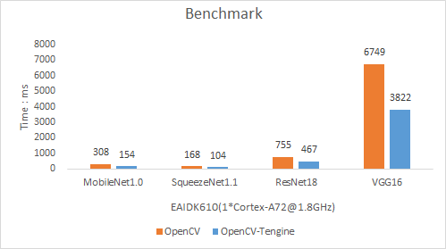

# Introduction/Configuration

Tengine (https://github.com/OAID/Tengine) is the efficient Deep Learning inference library for ARM. Since OpenCV v3.4.10 and OpenCV v4.3.0 it's possible to compile OpenCV with Tengine support and that results in a significant performance improvements on ARM:



Both 32-bit and 64-bit ARM architectures are supported as long as they provide NEON instructions.

There are two ways to build OpenCV with Tengine support:
1. Use the pre-compiled Tengine binaries
2. Automatically download Tengine and compile it during OpenCV configuration using CMake.

## Using pre-compiled Tengine binaries

The following flags should be passed to OpenCV CMake script:

```
 -DOPENCV_LIBTENGINE_ROOT_DIR=/UserFileDir/Tengine-library-dir
 -DWITH_TENGINE=ON
```

In this case the Tengine should be separately downloaded from github, `tengine-opencv` branch:
https://github.com/OAID/Tengine/tree/tengine-opencv

The compiled Tengine tree should have the following structure:

```
   /UserFileDir/Tengine-library-dir
   ├── include
   │   ├── cpu_device.h
   │   ├── tengine_c_api.h
   │   ├── tengine_c_compat.h
   │   └── tengine_operations.h
   └── lib
       └── libtengine.a
```

## Compiling Tengine from source

To compile OpenCV on Android with Tengine support you need to have Android NDK r14 or newer. To cross-compile OpenCV for ARM Linux you need to install the following packages:

```
sudo apt install g++-arm-linux-gnueabihf # for 32-bit ARM
sudo apt install g++-aarch64-linux-gnu # for 64-bit ARM (aarch64)
```

After you installed all the prerequisites, just run OpenCV CMake script with

```
-DWITH_TENGINE=ON
```

flag.
